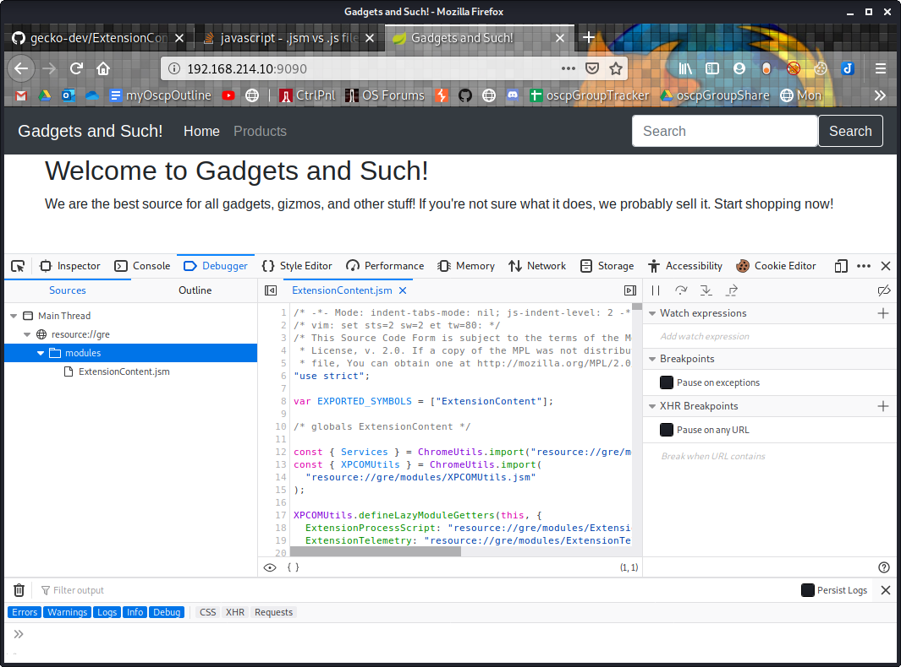
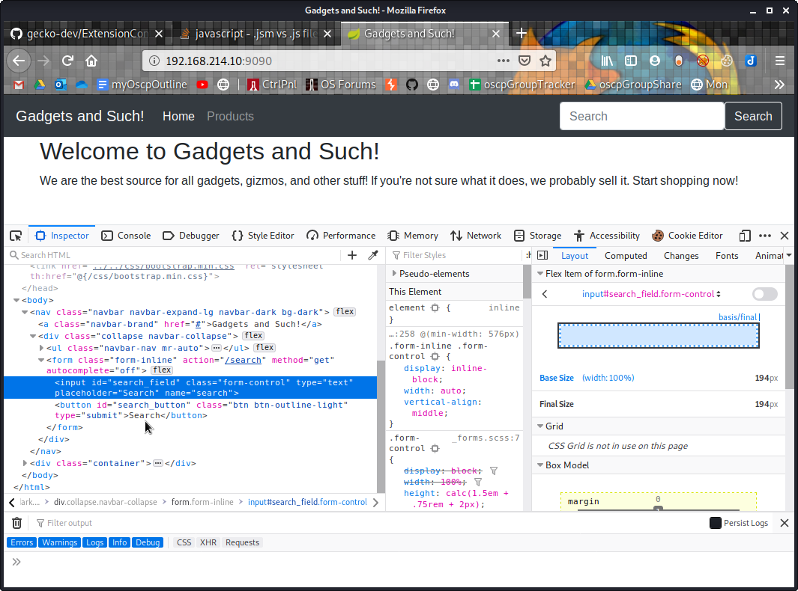
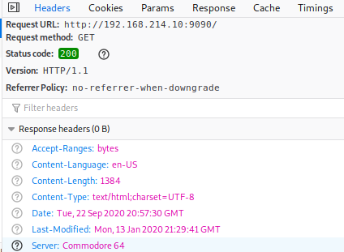
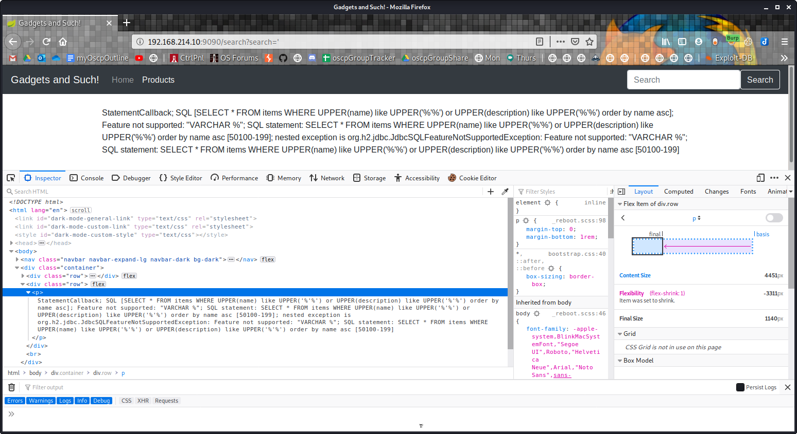
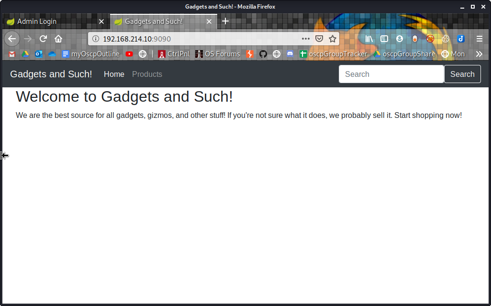
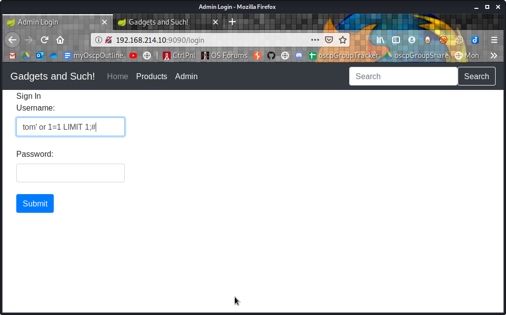

9.5.1 *

# 9.5.1 *
## 9.5.1.1. Identify and exploit the XSS vulnerability in the web application.

### Inspect Page content
Firefox Debugger tool shows us that the site resources use .jsm files (ie. JavaScript files)


Use the Inspector Tool on the 'Search' box. It uses the GET method


### View Response Headers
View the response headers. The web server is Commodore 64 on the landing page, product page, submitting a search, or when submitting login.


### The 'SEARCH' box
Let's try using forbidden characters: `<>'"{};`

We see that the single quote `'` produces a SQL syntax error.


### The 'login' page
We notice that 


## 9.5.1.2. Identify and exploit the SQL injection vulnerability in the web application.

### View the landing page
http://192.168.214.10:9090/


### Look for ways to bypass authentiation
Run dirb. We find that there are interesting directories named /admin and /login
```plaintext
kali@kali:~$ dirb http://192.168.214.10:9090

-----------------
DIRB v2.22    
By The Dark Raver
-----------------

START_TIME: Tue Sep 22 07:34:02 2020
URL_BASE: http://192.168.214.10:9090/
WORDLIST_FILES: /usr/share/dirb/wordlists/common.txt

-----------------

GENERATED WORDS: 4612                                                          

---- Scanning URL: http://192.168.214.10:9090/ ----
+ http://192.168.214.10:9090/admin (CODE:500|SIZE:138)                                                                    
+ http://192.168.214.10:9090/error (CODE:500|SIZE:105)                                                                    
+ http://192.168.214.10:9090/favicon.ico (CODE:200|SIZE:946)                                                              
+ http://192.168.214.10:9090/index.html (CODE:200|SIZE:1384)                                                              
+ http://192.168.214.10:9090/login (CODE:200|SIZE:1514)                                                                   
+ http://192.168.214.10:9090/products (CODE:200|SIZE:2509)                                                                
+ http://192.168.214.10:9090/search (CODE:200|SIZE:2566)                                                                 
                                                                                                                          
-----------------
END_TIME: Tue Sep 22 07:36:00 2020
DOWNLOADED: 4612 - FOUND: 7
```

View the login page
http://192.168.214.10:9090/login


Try to login as in the book example



## 9.5.1.3. Is it possible to gain a shell through the SQL injection vulnerability? Why or why not?


